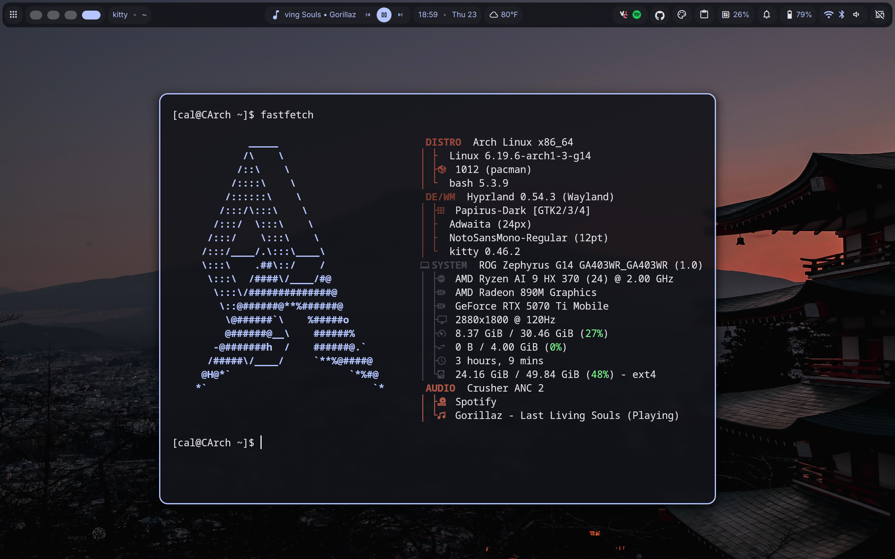

dotfiles for my arch linux laptop, CArch
yes, I am aware the repo is called Charch and not CArch

Dank Linux https://danklinux.com/

auto syncs on startup

# Screenshots

## Waybar

## Desktop

## FastFetch

## More Screenshots

